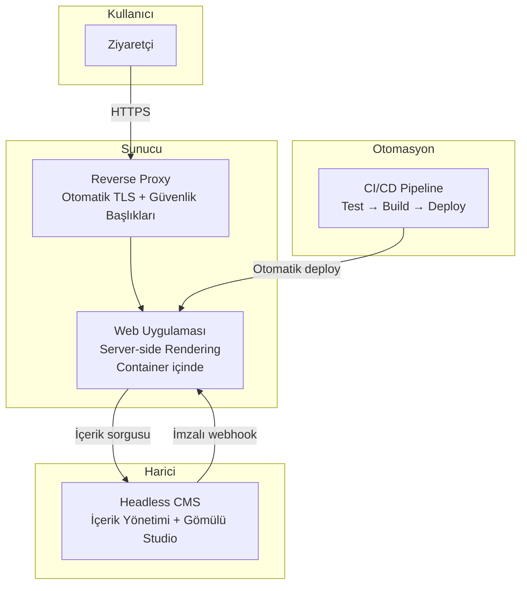
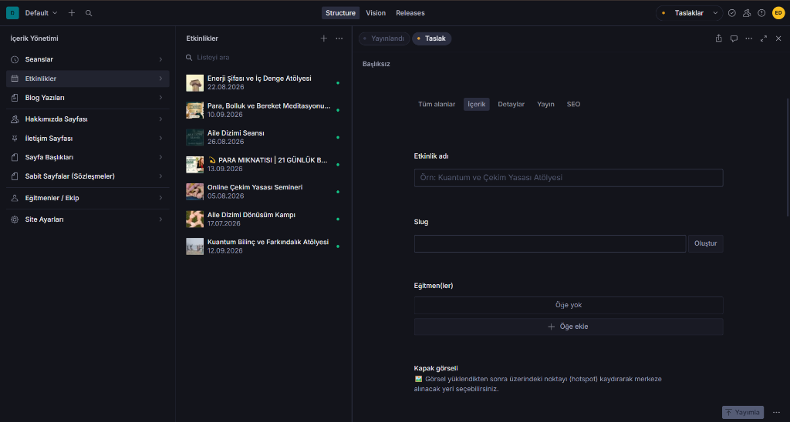
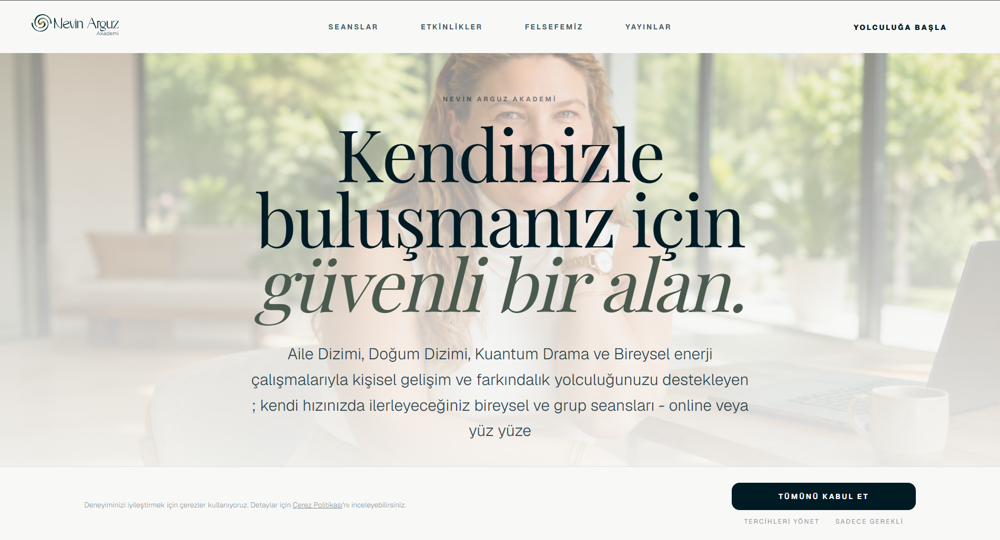
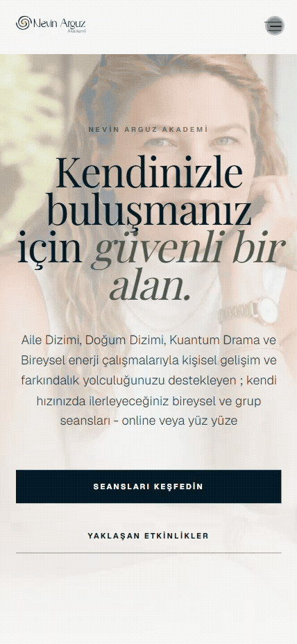
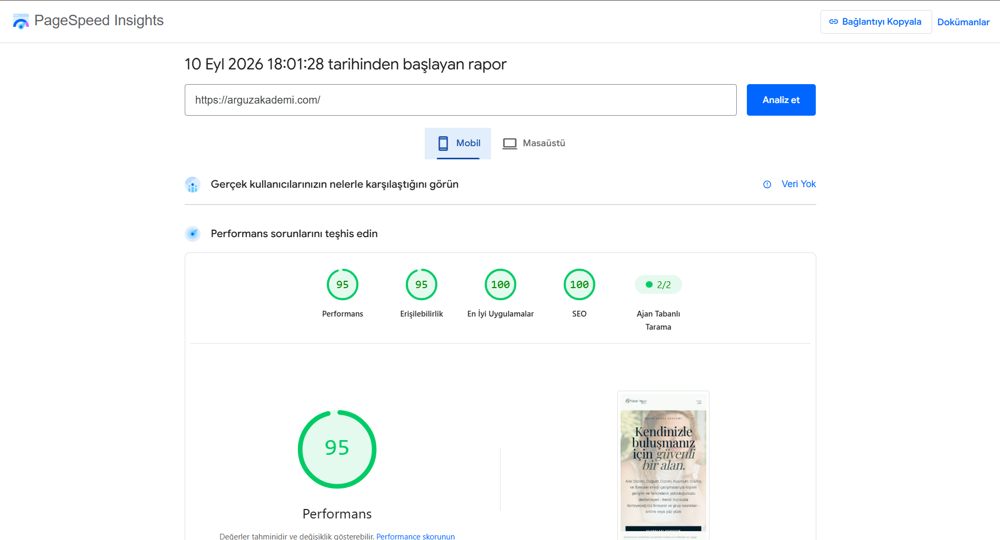

# Arguz Akademi — Mimari Case Study

> Danışmanlık ve atölye ekosistemini dijitale taşıyan, %100 Headless CMS ile yönetilen (sıfır hardcoded metin), parametrik WhatsApp dönüşüm hunisi (CRO) ve çift katmanlı SEO altyapısına sahip kurumsal web platformunun mimari dokümantasyonu.

> [!NOTE]
> Bu repo bir **mimari case study**'dir — kaynak kod içermez. Üretim kod tabanı private repository'dedir.
> Aşağıda mühendislik kararlarını, tasarım desenlerini ve elde edilen sonuçları anlatıyorum.

---

## Problem ve İhtiyaçlar

Müşteri mevcut dağıtım ağını genişletmek, yeni danışanlar edinmek ve kurumsal bir kimlik oluşturmak istiyordu. Aynı zamanda mevcut danışmanlık satışlarını web ortamına taşımak istiyordu; ancak klasik bir e-ticaret mantığında değil, yönlendirme şeklinde.

İhtiyaçlar:

- **Satış & Dönüşüm (CRO)** — Kredi kartı olmadan; sepet mantığıyla seçilen seans, gün ve saatin otomatik mesajla WhatsApp hattına aktarılması
- **İçerik Yönetimi** — Teknik bilgisi olmayan müşterinin, kodda hardcoded metin bırakılmadan tüm alanları CMS üzerinden kendisinin güncelleyebilmesi
- **Hız** — Sayfa yükleme süresi 3 saniyenin altında olmalı, yüksek mobil performans
- **SEO & Organik Büyüme** — Google Rich Results desteği (etkinlik, SSS, hizmet snippet'ları) ve Inbound Blog yapısı
- **Güvenlik** — HTTPS, güvenlik başlıkları, KVKK/GDPR uyumlu çerez yönetimi (Consent Mode v2)
- **Maliyet** — Öngörülebilir sabit aylık maliyet, sürpriz usage-based fatura riski olmaması
- **Genişletilebilirlik** — İleride online ödeme altyapısına geçilmek istendiğinde baştan yazım gerektirmeyen esnek şema modeli

---

## Çözüm

Modern headless CMS mimarisi üzerine kurulu, container tabanlı, otomatik TLS'li bir web platformu geliştirdim.

---

## Teknoloji Seçimleri

| Katman | Teknoloji | Karar Gerekçesi |
|---|---|---|
| **Framework** | Next.js (App Router) | Server Components ile minimum istemci JS, yerleşik SEO metadata API'si |
| **CMS** | Sanity.io | Gömülü Studio, GROQ sorgu dili, TypeGen, webhook desteği |
| **Stil** | Tailwind CSS + Framer Motion | Semantic design token sistemi, erişilebilir animasyonlar |
| **Dil** | TypeScript (strict) | CMS verileri dahil derleme zamanı tip güvenliği |
| **Container** | Docker (multi-stage) | Non-root çalışma, tutarlı ortam, küçük image |
| **Reverse Proxy** | Caddy (Otomatik TLS) | Sertifika yönetimi tamamen otomatik |
| **CI/CD** | GitHub Actions | Push-to-deploy, quality gate (tip kontrolü + testler) |
| **Analitik** | Consent Mode v2 uyumlu | KVKK/GDPR, kullanıcı izni olmadan analitik tetiklenmez |

Her seçimin detaylı gerekçesi ve alternatif değerlendirmesi → [docs/kararlar/](docs/kararlar/)

---

## Mimari Öne Çıkanları

### Anlık İçerik Güncellemesi

CMS'te içerik yayınlandığında, imzalı webhook tetiklenir ve sadece etkilenen sayfalar tazelenir — tam rebuild gerekmez. **Sonuç:** İçerik güncellemesi **2 saniyenin altında** canlıya yansıyor.

→ [Detay: Cache Invalidation Kararı](docs/kararlar/003-cache-invalidation.md)

### Programatik SEO

7 ayrı Schema.org JSON-LD builder fonksiyonu — hepsi saf (pure), hepsi birim test edilmiş. Dinamik sitemap ve sayfa bazlı OpenGraph desteği.

→ [Detay: SEO Stratejisi](docs/kararlar/004-seo-stratejisi.md) · [Kod Deseni: JSON-LD Builder](docs/kaliplar/structured-data-builder.md)

### Server / Client Ayrımı

Varsayılan olarak Server Component — istemciye JavaScript yalnızca etkileşim gereken bileşenlere gönderiliyor. İş mantığı framework'ten bağımsız saf fonksiyonlarda.

→ [Detay: Component Mimarisi](docs/kararlar/005-component-mimarisi.md) · [Kod Deseni: Saf Fonksiyon Ayrıştırma](docs/kaliplar/is-mantigi-ayristirma.md)

### Semantic Design Token Sistemi

İki katmanlı renk mimarisi: Core Tokens (ham değerler) → Semantic Tokens (anlamsal kullanım). Marka tutarlılığı token seviyesinde zorunlu kılınmış.

→ [Kod Deseni: Design Token Sistemi](docs/kaliplar/design-token-sistemi.md)

### Sıfır Hardcoded Metin & Granüler Şema Mimarisi

Arayüzdeki tek bir metin, buton etiketi veya görsel bile kodda statik (hardcoded) bırakılmadı. 11 farklı Sanity şeması üzerinden en küçük mikro kopya (microcopy) dahi yönetilebilir kılındı. Paneldeki yönlendirici Türkçe açıklamalar, sınırlandırılmış alanlar ve görsel kontroller sayesinde içerik yöneticisi geliştirici desteğine ihtiyaç duymadan tüm platformu bağımsızca yönetebiliyor.

---

## Sonuçlar

| Metrik | Değer |
|---|---|
| Mobil Lighthouse Performans | **95** / 100 |
| Mobil Lighthouse Erişilebilirlik | **95** / 100 |
| Mobil Lighthouse En İyi Uygulamalar | **100** / 100 |
| Mobil Lighthouse SEO | **100** / 100 |
| İçerik güncelleme süresi | Saatler → **< 2 saniye** (İmzalı Webhook + ISR) |
| CI/CD çalıştırması | **88+** başarılı deployment |
| CMS şema tipi | **11** document type (6 singleton + 5 collection) |
| Component sayısı | **35+** (Atomic Design hiyerarşisi) |
| JSON-LD schema | **7** Schema.org builder (test edilmiş) |
| Güvenlik başlığı | **5** hardened HTTP header |
| Container | Multi-stage build, non-root çalışma |

---

## Arayüz & İçerik Yönetimi

### Gömülü Sanity Studio (İçerik Yönetim Paneli)

> Müşterinin seansları, etkinlikleri, eğitmenleri ve SEO metadata'larını kodsuz yönetebilmesi için kurgulanan özelleştirilmiş Sanity Studio arayüzü. 11 farklı şema tipi (Singleton + Collection), Türkçe alan tanımlamaları ve görsel hotspot desteği ile tasarlandı.

### Kullanıcı Arayüzü & Mobil Etkileşim (Canlı Üretim Ortamı)

> Platform, **4+ aydır canlı üretim (production) ortamında kesintisiz** hizmet vermektedir. Aşağıdaki görseller ve etkileşimler güncel canlı sistemi yansıtmaktadır.

| Masaüstü Görünümü | Mobil Arayüz & Menü Etkileşimi |
|---|---|
|  |  |

---

## Doküman Haritası

| Doküman | İçerik |
|---|---|
| [Mimari Genel Bakış](docs/mimari-genel-bakis.md) | Katman ayrımı, veri akışı, component stratejisi |
| | |
| **Kararlar (ADR)** | |
| [CMS Seçimi](docs/kararlar/001-cms-secimi.md) | WordPress vs Strapi vs Contentful vs Sanity |
| [Deployment Stratejisi](docs/kararlar/002-deployment-stratejisi.md) | Vercel vs VPS + Container |
| [Cache Invalidation](docs/kararlar/003-cache-invalidation.md) | SSG vs ISR vs Webhook revalidation |
| [SEO Stratejisi](docs/kararlar/004-seo-stratejisi.md) | Manuel vs programatik structured data |
| [Component Mimarisi](docs/kararlar/005-component-mimarisi.md) | Düz yapı vs Atomic Design |
| | |
| **Kod Desenleri** | |
| [JSON-LD Builder](docs/kaliplar/structured-data-builder.md) | Saf fonksiyon + test örneği |
| [Design Token Sistemi](docs/kaliplar/design-token-sistemi.md) | İki katmanlı CSS token mimarisi |
| [Saf Fonksiyon Ayrıştırma](docs/kaliplar/is-mantigi-ayristirma.md) | İş mantığını framework'ten ayırma deseni |

---

## İlgili Projeler

| Proje | Açıklama | Tür |
|---|---|---|
| **[WhatsApp AI Agent Platformu](../whatsapp-agent-casestudy)** | E-ticaret için multi-agent AI müşteri hizmeti ve HITL | Mimari Case Study |
| **[MCP Server — Mikro ERP](../MikroFlyErp-MCPSERVER)** | Mikro ERP veritabanını yapay zekaya bağlayan MCP sunucusu | Açık Kaynak |

---

## Hakkımda

**Burak Emre Dalbudak** — Full Stack Geliştirici & AI Entegrasyon Uzmanı

