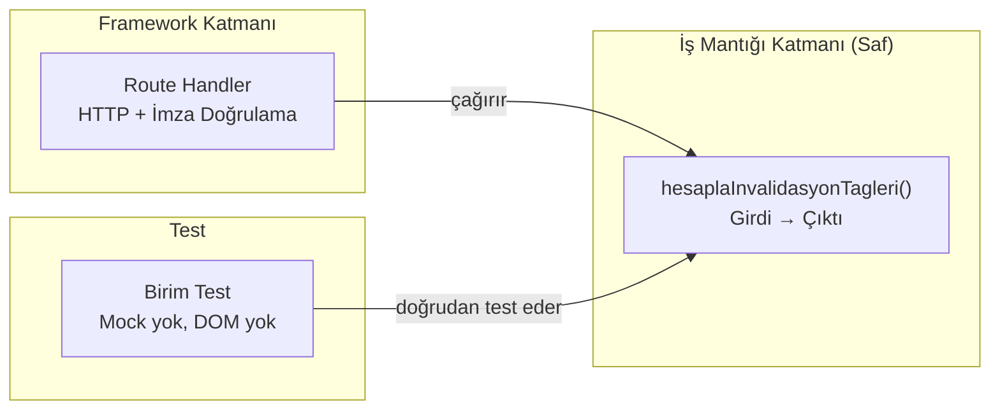

# Saf Fonksiyon Ayrıştırma Deseni

**Problem:** Webhook handler'lar, route handler'lar ve component'ler içinde iş mantığı yazıldığında:
- Test etmek için HTTP request mock'lamak gerekiyor
- Mantık değiştiğinde framework kodu da etkileniyor
- Aynı mantık birden fazla yerde tekrarlanıyor

**Çözüm:** İş mantığını framework'ten bağımsız **saf fonksiyonlara** çıkar. Bu fonksiyonlar:
- DOM'a erişmez
- Ağ çağrısı yapmaz
- Global state değiştirmez
- Girdi alır → çıktı döner, hepsi bu

**Güvenli kod snippet'ı — Cache tag hesaplama:**

```typescript
// Saf fonksiyon: CMS tip + slug → invalidate edilecek cache tag'leri
// Route handler bu fonksiyonu çağırır — mantık burada, HTTP burada değil.

const REFERANS_TIPLERI: Record<string, string[]> = {
  egitmen: ['hakkimizda', 'yazi', 'etkinlik'],
};

export function hesaplaInvalidasyonTagleri(
  tip: string,
  slug?: string
): string[] {
  const tags = new Set<string>();

  if (REFERANS_TIPLERI[tip]) {
    // Cascade: referans edilen kayıt değiştiğinde,
    // onu kullanan tüm içerik tipleri tazelenir
    REFERANS_TIPLERI[tip].forEach((tag) => tags.add(tag));
  } else if (slug) {
    tags.add(tip);                // Liste sayfası
    tags.add(`${tip}-${slug}`);   // Detay sayfası
  } else {
    tags.add(tip);
  }

  return [...tags];
}
```

**Test:**

```typescript
import { describe, it, expect } from 'vitest';
import { hesaplaInvalidasyonTagleri } from './webhookTags';

describe('hesaplaInvalidasyonTagleri', () => {
  it('slug varsa hem tip hem detay tag döner', () => {
    expect(hesaplaInvalidasyonTagleri('seans', 'regresyon'))
      .toEqual(['seans', 'seans-regresyon']);
  });

  it('eğitmen değiştiğinde cascade tag döner', () => {
    expect(hesaplaInvalidasyonTagleri('egitmen'))
      .toEqual(['hakkimizda', 'yazi', 'etkinlik']);
  });
});
```

**Mimari diyagram:**



**Prensip:** Route handler sadece HTTP işleriyle ilgilenir (request parse, imza doğrulama, response dönme). İş kararları saf fonksiyonda. Bu sayede route handler'ı hiç mock'lamadan iş mantığını test edebiliyorum.

Bu desen projede 4 modülde uygulandı: cache tag hesaplama, structured data üretimi, çerez tercihi yönetimi ve durum rozeti çözümleme. Hepsinin birim testleri var.
