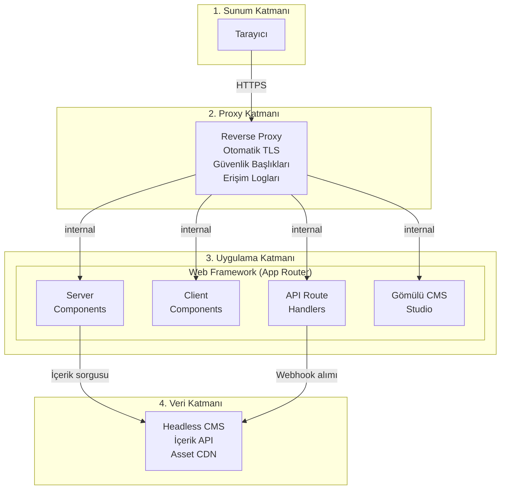
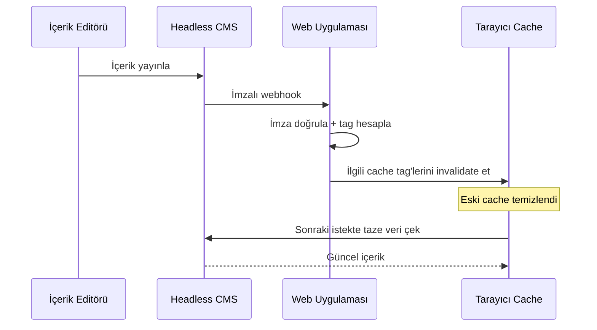
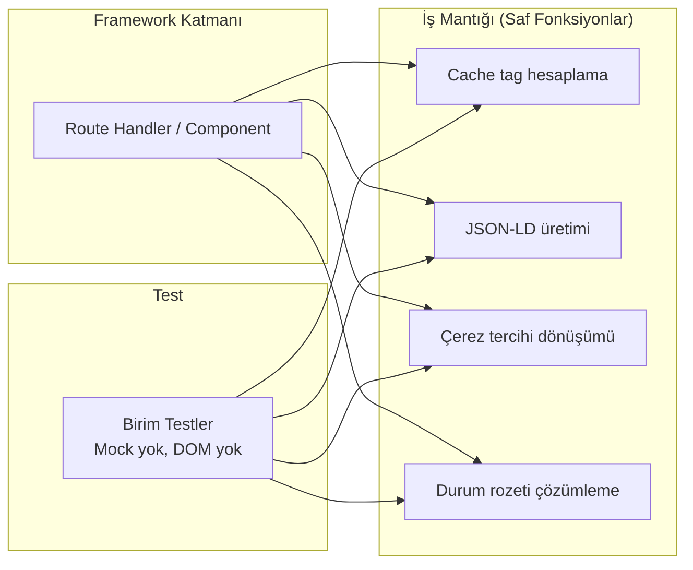

# Mimari Genel Bakış

Bu doküman, Arguz Akademi web platformunun yüksek seviye mimarisini ve katman ayrımını anlatır.

---

## Sistem Katmanları

Platform 4 katmandan oluşuyor:



---

## Katman Sorumlulukları

### Katman 1 — Sunum (Tarayıcı)

Kullanıcıya ulaşan HTML büyük ölçüde sunucu tarafında render edilmiş. İstemciye gönderilen JavaScript yalnızca etkileşim gerektiren bileşenlere ait:
- Form doğrulamaları ve gönderimi
- Scroll-triggered animasyonlar
- Çerez tercihi yönetimi (Consent Mode)

### Katman 2 — Reverse Proxy

Uygulama sunucusunun önünde çalışan proxy katmanı:
- **Otomatik TLS** — sertifika alımı ve yenilemesi tamamen otomatik
- **HSTS** — tarayıcıları HTTPS'e zorunlu yönlendirme
- **Güvenlik başlıkları** — clickjacking, content-type sniffing, gereksiz API erişimi engeli
- **Erişim logları** — yapılandırılmış formatta, rotasyonlu dosya loglaması

### Katman 3 — Uygulama

Web framework (App Router) mimarisiyle 4 sorumluluk alanı:

| Alan | Açıklama |
|---|---|
| **Server Components** | Veri çekme, SEO metadata üretimi, HTML render — JavaScript istemciye gönderilmez |
| **Client Components** | Formlar, animasyonlar, çerez yönetimi — `'use client'` ile işaretli |
| **API Route Handlers** | Webhook alımı, health check — sunucu taraflı endpoint'ler |
| **Gömülü CMS Studio** | İçerik yönetim paneli aynı domain üzerinde, ayrı deploy gerektirmiyor |

### Katman 4 — Veri (Headless CMS)

İçerik tamamen headless CMS üzerinde yönetiliyor. İletişim iki yönlü:



---

## Server / Client Component Stratejisi

Varsayılan olarak **her bileşen Server Component**. Client sınırı yalnızca şu durumlarda ekleniyor:

| Tetikleyici | Katman | Örnek |
|---|---|---|
| `useState`, `useEffect` | Features (Client) | Form bileşenleri |
| `onClick`, `onChange` | Features (Client) | Etkileşimli butonlar |
| `localStorage` | Features (Client) | Consent banner |
| `IntersectionObserver` | Features (Client) | Scroll animasyonları |
| **Hiçbiri gerekmiyorsa** | **Organisms (Server)** | Hero, Footer, Navbar yapısı |

**Kural:** Bir bileşende tarayıcı API'si gerekiyorsa → Client Component. Gerekmiyorsa → Server Component kalır, istemciye JavaScript gönderilmez.

---

## CMS Veri Çekme Mimarisi

CMS sorguları bileşen dosyalarından ayrılmış (Separation of Concerns):

```
Sorgu Dosyaları (şema bazlı)
    ↓ defineQuery() ile tipli sorgu tanımı
Merkezi Fetch Fonksiyonu
    ↓ cache tag + revalidation süresi ekleme
CMS CDN API
    ↓ Tipli sonuç (TypeGen)
Framework Data Cache (tag'li)
    ↓
Sayfa Bileşeni → HTML
```

**Avantajları:**
- Sorgular tek noktada yönetiliyor, tekrar yok
- Her sorgu cache tag'i alıyor — webhook geldiğinde sadece ilgili tag invalidate ediliyor
- TypeGen ile sorgu sonuçları derleme zamanında tipli

---

## İş Mantığı Katmanı

Framework'e bağımlı olmayan iş mantığı, saf fonksiyonlara çıkarılmış:



Bu fonksiyonlar DOM'a, ağ çağrılarına veya global state'e bağımlı değil — girdi alır, çıktı döner. Bu sayede birim testler trivial ve hızlı.

---

## Sonraki Dokümanlar

| Doküman | Konu |
|---|---|
| **Kararlar** | |
| [001 — CMS Seçimi](kararlar/001-cms-secimi.md) | WordPress vs Strapi vs Contentful vs Sanity |
| [002 — Deployment](kararlar/002-deployment-stratejisi.md) | Vercel vs VPS + Container |
| [003 — Cache Invalidation](kararlar/003-cache-invalidation.md) | SSG vs ISR vs Webhook |
| [004 — SEO Stratejisi](kararlar/004-seo-stratejisi.md) | Manuel vs programatik structured data |
| [005 — Component Mimarisi](kararlar/005-component-mimarisi.md) | Düz yapı vs Atomic Design |
| **Kod Desenleri** | |
| [JSON-LD Builder](kaliplar/structured-data-builder.md) | Saf fonksiyon + test örneği |
| [Design Token Sistemi](kaliplar/design-token-sistemi.md) | İki katmanlı CSS token mimarisi |
| [Saf Fonksiyon Ayrıştırma](kaliplar/is-mantigi-ayristirma.md) | İş mantığını framework'ten ayırma |
